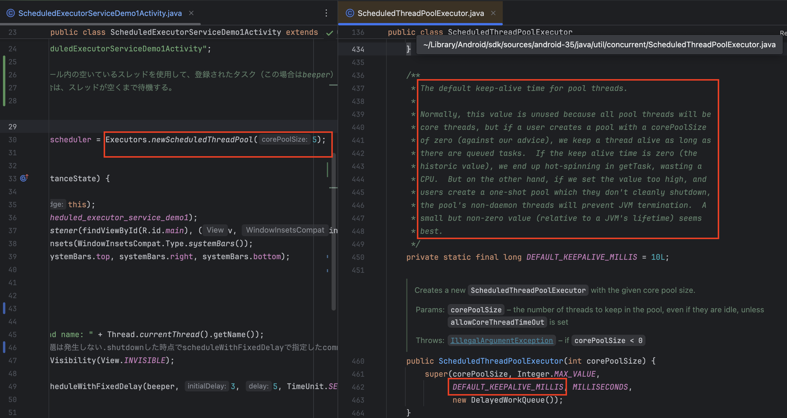
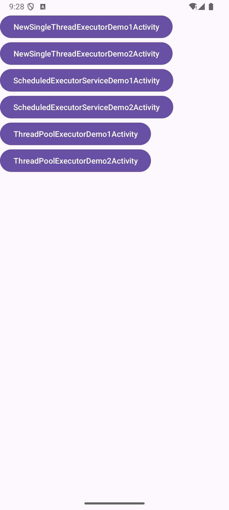

# development enviroment
```
Android Studio Meerkat Feature Drop | 2024.3.2 Nightly 2025-01-29
```

# memo

An experiment on thread management while an Android app is running. <br>
The results of the investigation are written in the comments of each Activity. <br>
The results will be organized later and compiled in the README. <br>



# environment: Emulator Medium Phone API 35

Check the maximum number of processes and threads that can be run on the device at the same time.
```shell
adb shell cat /proc/sys/kernel/pid_max
```
In this case, the output is 32768.
```shell
32768
````



# STEP1: Find the process ID of a running app

run the following adb command.

```shell
adb shell ps | grep com.example.androidthreadsample
```

You will get the following output, where `5358` is the process ID.

```shell
u0_a243       5358   417   16407932 157840 0                   0 S com.example.androidthreadsample
```

# STEP2：Check the number of running threads by specifying the process ID

run the following adb command.

```shell
adb shell ps -T | grep 5358
```

The output will look like this. In this case, `pool-6-thread-1` is the running thread.<br>
`pool-x-thread-x` represents a thread in the thread pool.<br>

```shell
u0_a243       5358  5358   417   16460524 159436 0                   0 S oidthreadsample
u0_a243       5358  5359   417   16460524 159436 0                   0 S Signal Catcher
u0_a243       5358  5360   417   16460524 159436 0                   0 S perfetto_hprof_
u0_a243       5358  5361   417   16460524 159436 0                   0 S ADB-JDWP Connec
u0_a243       5358  5362   417   16460524 159436 0                   0 S Jit thread pool
u0_a243       5358  5363   417   16460524 159436 0                   0 S HeapTaskDaemon
u0_a243       5358  5364   417   16460524 159436 0                   0 S ReferenceQueueD
u0_a243       5358  5365   417   16460524 159436 0                   0 S FinalizerDaemon
u0_a243       5358  5366   417   16460524 159436 0                   0 S FinalizerWatchd
u0_a243       5358  5367   417   16460524 159436 0                   0 S binder:5358_1
u0_a243       5358  5368   417   16460524 159436 0                   0 S binder:5358_2
u0_a243       5358  5370   417   16460524 159436 0                   0 S Profile Saver
u0_a243       5358  5371   417   16460524 159436 0                   0 S binder:5358_3
u0_a243       5358  5372   417   16460524 159436 0                   0 S RenderThread
u0_a243       5358  5375   417   16460524 159436 0                   0 S TracingMuxer
u0_a243       5358  5376   417   16460524 159436 0                   0 S SurfaceSyncGrou
u0_a243       5358  5378   417   16460524 159436 0                   0 S hwuiTask0
u0_a243       5358  5379   417   16460524 159436 0                   0 S hwuiTask1
u0_a243       5358  5388   417   16460524 159436 0                   0 S binder:5358_3
u0_a243       5358  5494   417   16460524 159436 0                   0 S binder:5358_4
u0_a243       5358  5495   417   16460524 159436 0                   0 S binder:5358_5
u0_a243       5358  5506   417   16460524 159436 0                   0 S pool-6-thread-1
```

# Tips: Check the number of threads for a specific process (e.g., process ID 5358)

```shell
adb shell ps -T -p 5358 | wc -l
```